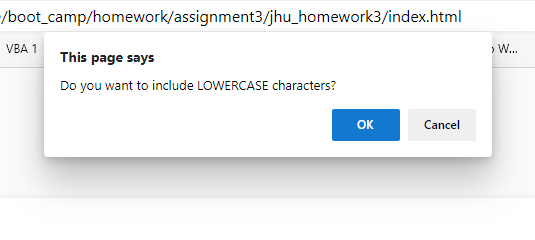

# 03 JavaScript: Password Generator

This project required the use of JS to generate a random password. For this, I am thankful the HTML and CSS were completed, as if I had to develop those this assignment would have been much more challenging. 

There is only one commit on this file, as I wrote the logic in one sitting. Unlike HTML elements, the js comes very naturally to me. In the future I will be sure to commit and push to GitHub in more frequent intervals. 

# Improvements to be made

I am happy with the error checking I was able to put into play, but one thing I would revise is the possibility of an infinite loop. I would add a counter to the while loops, and if after 3 attempts the user did not enter a valid response I would abort the code. 

